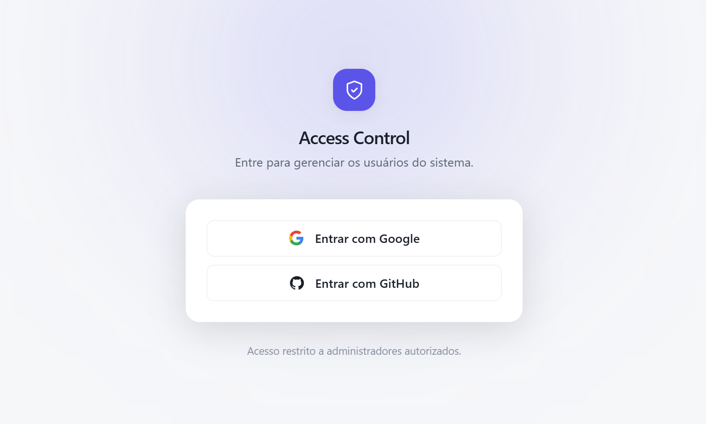
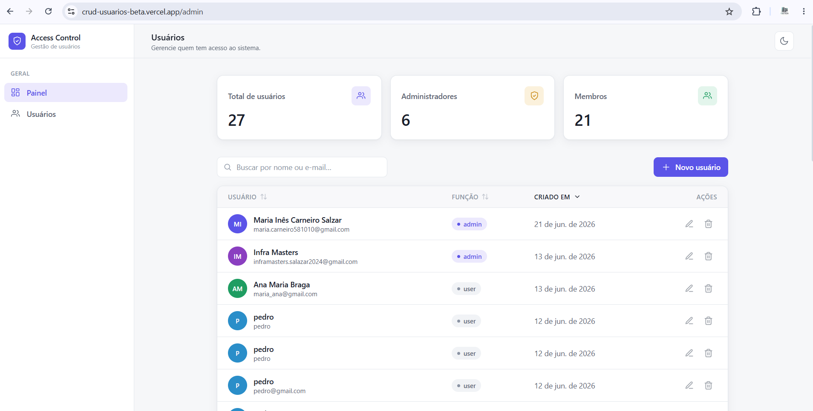
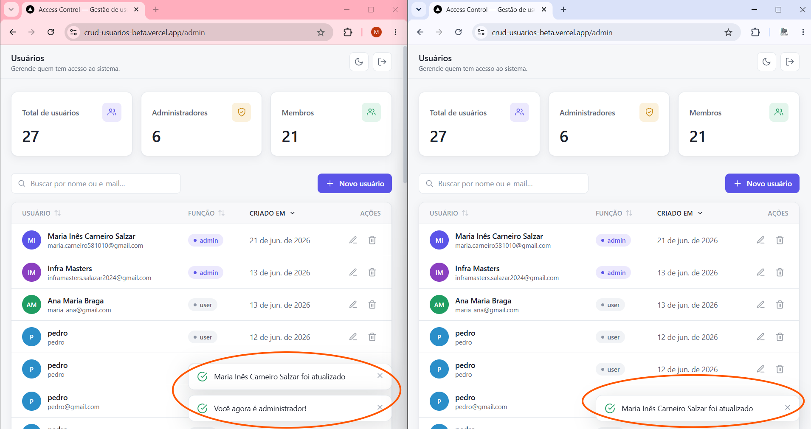

# Access Control — Gestão de Usuários em Tempo Real

Painel de gestão de usuários com autenticação, controle de acesso por papéis (RBAC) e sincronização em tempo real via WebSocket. Qualquer alteração feita por um usuário autorizado é refletida instantaneamente em todos os clientes conectados, sem recarregar a página.

**🔗 Demo em produção:** [crud-usuarios-beta.vercel.app](https://crud-usuarios-beta.vercel.app)
**📦 Repositório:** [github.com/Doug1980/crud-usuarios](https://github.com/Doug1980/crud-usuarios)

---

## Preview

<!--
  Para exibir os screenshots:
  1. Crie uma pasta `docs/` na raiz do projeto.
  2. Salve as imagens lá (ex.: docs/login.png, docs/dashboard.png).
  3. Faça commit das imagens junto com o README.
  Os caminhos abaixo já apontam para docs/ — basta adicionar os arquivos.
-->

### Tela de login


### Painel de usuários


### RBAC dinâmico em tempo real


---

## Visão geral

O **Access Control** é um painel administrativo (SaaS-style) onde usuários autenticados gerenciam registros de acesso. O sistema implementa permissões granulares por papel — administradores têm controle total, enquanto usuários comuns têm acesso restrito — e mantém todos os clientes sincronizados em tempo real.

O grande diferencial é o **RBAC dinâmico**: um usuário comum pode ser promovido a administrador por outro admin, e essa mudança de privilégio é aplicada **instantaneamente** na sessão do usuário promovido, sem necessidade de logout ou refresh.

---

## Stack

| Camada | Tecnologia |
|---|---|
| Framework | Next.js 16 (App Router) |
| Linguagem | TypeScript |
| Estilização | Tailwind CSS v4 (dark mode nativo) |
| Autenticação | Firebase Auth (Google + GitHub) |
| Banco de dados | MongoDB Atlas |
| Tempo real | Pusher Channels (WebSocket) |
| Deploy | Vercel |

---

## Funcionalidades

- **CRUD completo** de usuários (criar, listar, editar, excluir), persistido no MongoDB.
- **Autenticação social** com Google e GitHub via Firebase Auth.
- **Controle de acesso por papel (RBAC)** validado no servidor a cada requisição.
- **Sincronização em tempo real** — criações, edições e exclusões propagam para todas as abas/clientes conectados via WebSocket.
- **RBAC dinâmico** — promoção e rebaixamento de papel aplicados em tempo real, sem refresh.
- **Notificações contextuais** (toasts) para cada evento, incluindo aviso de mudança do próprio papel.
- **Dark mode** com persistência e proteção contra flash de tema incorreto.
- **UX de dashboard** — cards de métricas, tabela com ordenação, busca, avatares, badges, skeleton loading e modais animados.

---

## Matriz de permissões

| Ação | Usuário comum | Admin |
|---|:---:|:---:|
| Listar usuários | ✅ | ✅ |
| Criar usuário | ✅ | ✅ |
| Editar usuário | ✅ | ✅ |
| Excluir usuário | ❌ | ✅ |
| Atribuir papel "admin" | ❌ | ✅ |

> A autorização é **sempre** revalidada no servidor. O front-end apenas oculta ou desabilita ações por questão de experiência — a decisão real de permissão nunca depende do cliente.

---

## Decisões de arquitetura

**WebSocket gerenciado (Pusher) em vez de socket próprio.**
Funções serverless (Vercel) não mantêm conexões WebSocket persistentes. Por isso, a comunicação em tempo real é delegada a um broker gerenciado (Pusher Channels), que distribui os eventos disparados pelas API Routes para todos os clientes conectados.

**Modelo de admin híbrido (infraestrutura + banco).**
Existem dois tipos de administrador: os **admins raiz**, definidos por variável de ambiente (`ADMIN_EMAILS`) e protegidos contra rebaixamento pela interface; e os **admins promovidos**, cujo papel é persistido no banco e gerenciado pela própria aplicação. A função de autorização considera ambas as fontes — é admin quem está na allowlist de infra **ou** tem o papel `admin` registrado no banco.

**Segurança no servidor, UX no cliente.**
O front-end esconde botões e ações conforme o papel apenas para guiar o usuário. Toda escrita (criar, editar, excluir, promover) é revalidada no servidor a cada requisição, derivando o papel efetivo do token autenticado — nunca confiando em dados enviados pelo cliente.

**Atualização otimista a partir do evento.**
Para refletir a mudança de papel em tempo real, a aplicação usa o próprio payload do evento WebSocket como fonte da verdade para a UI, evitando uma reconsulta ao servidor que competiria com a propagação da escrita no banco. A autorização efetiva continua sempre validada no servidor a cada requisição.

---

## Desafios técnicos

Esta seção documenta os problemas mais relevantes enfrentados e como foram resolvidos.

### 1. `ERR_REQUIRE_ESM` no ambiente serverless

**Sintoma.** O projeto funcionava perfeitamente em desenvolvimento, mas em produção (Vercel) toda rota de API que validava autenticação retornava erro 500. À primeira vista, parecia falha de conexão com o banco.

**Diagnóstico.** Os logs de runtime revelaram a causa real: o `firebase-admin`, usado para verificar o token no servidor, depende de `jwks-rsa`, que por sua vez importava o `jose` em formato ESM via `require()` (CommonJS) — uma incompatibilidade que só se manifesta no ambiente serverless. Investigando, identifiquei dois fatores combinados: o bundler padrão do Next 16 (Turbopack) não externalizava o pacote corretamente, e a árvore de dependências havia resolvido uma versão ESM-only do `jose`.

**Solução.** Atacar as duas causas: forçar o **Webpack** no build de produção (em vez do Turbopack) e fixar o `jose` em uma versão CommonJS-compatível via `overrides` no `package.json`. O build de produção foi validado localmente antes de cada deploy, evitando tentativas às cegas.

### 2. RBAC dinâmico — race condition na atualização de papel

**Sintoma.** Ao promover um usuário a admin, a mudança só refletia na sessão dele após um refresh manual. Além disso, em certos cenários, o admin que realizava a promoção perdia o próprio acesso temporariamente.

**Diagnóstico.** A aplicação reconsultava o servidor (`/api/me`) ao receber o evento de atualização, mas essa leitura competia com a gravação no banco — frequentemente lendo o papel antigo (race condition). O segundo problema vinha de comparar e-mails no cliente, onde o e-mail do provedor pode vir indefinido.

**Solução.** Em vez de reconsultar o servidor, a UI passou a usar o próprio payload do evento WebSocket como fonte da verdade (atualização otimista), eliminando a corrida com o banco. A identidade do usuário passou a ser resolvida pelo e-mail confiável retornado pelo servidor, e a atualização de papel só é aplicada quando o evento diz respeito ao próprio usuário — preservando o acesso de quem realiza a ação.

### 3. Tempo real em ambiente serverless

**Desafio.** Sincronização em tempo real exige conexões WebSocket persistentes, mas funções serverless são efêmeras — sobem, respondem e encerram, sem manter conexões abertas.

**Solução.** Delegar a camada persistente a um broker gerenciado (Pusher Channels). A API serverless apenas faz uma chamada HTTP rápida para disparar o evento; o Pusher mantém as conexões WebSocket com os clientes e distribui as atualizações. Essa escolha mantém a compatibilidade com o modelo serverless sem exigir um servidor tradicional sempre ativo.

---

## Estrutura do projeto

```
src/
├── app/
│   ├── login/page.tsx          # Tela de login (Google/GitHub)
│   ├── admin/page.tsx          # Painel principal + tempo real
│   └── api/
│       ├── users/route.ts      # GET (listar) + POST (criar)
│       ├── users/[id]/route.ts # PATCH (editar) + DELETE (excluir)
│       └── me/route.ts         # Identidade e papel do usuário logado
├── components/                 # Sidebar, tabela, modais, cards, ícones
├── hooks/                      # useAuth, useTheme, useToast, usePusher, useIsAdmin
├── lib/
│   ├── firebase/               # Client SDK + Admin SDK (verificação de token)
│   ├── mongodb.ts              # Conexão singleton com o MongoDB
│   ├── pusher.ts               # Cliente Pusher do servidor
│   └── auth.ts                 # Verificação de token + lógica de autorização
└── types/                      # Tipagem do domínio
```

### Fluxo de uma operação

1. O front chama a API enviando o token Firebase no header.
2. A rota valida o token e checa a permissão conforme o papel.
3. A alteração é persistida no MongoDB.
4. Um evento é disparado no Pusher (`user:created` / `user:updated` / `user:deleted`).
5. Todos os clientes conectados recebem o evento e atualizam a interface em tempo real.

---

## Rodando localmente

### Pré-requisitos

- Node.js 18+
- Contas em: Firebase, MongoDB Atlas e Pusher

### Instalação

```bash
# 1. Clone o repositório
git clone https://github.com/Doug1980/crud-usuarios.git
cd crud-usuarios

# 2. Instale as dependências
npm install

# 3. Configure as variáveis de ambiente (veja abaixo)

# 4. Suba o servidor de desenvolvimento
npm run dev
```

Acesse `http://localhost:3000` — você será redirecionado para a tela de login.

### Variáveis de ambiente

Crie um arquivo `.env.local` na raiz com:

```env
# Firebase (client)
NEXT_PUBLIC_FIREBASE_API_KEY=
NEXT_PUBLIC_FIREBASE_AUTH_DOMAIN=
NEXT_PUBLIC_FIREBASE_PROJECT_ID=
NEXT_PUBLIC_FIREBASE_STORAGE_BUCKET=
NEXT_PUBLIC_FIREBASE_MESSAGING_SENDER_ID=
NEXT_PUBLIC_FIREBASE_APP_ID=

# Firebase Admin (servidor)
FIREBASE_ADMIN_PROJECT_ID=
FIREBASE_ADMIN_CLIENT_EMAIL=
FIREBASE_ADMIN_PRIVATE_KEY=

# MongoDB
MONGODB_URI=
MONGODB_DB=crud_usuarios

# Allowlist de administradores raiz (separados por vírgula)
ADMIN_EMAILS=seu-email@gmail.com

# Pusher (servidor)
PUSHER_APP_ID=
PUSHER_KEY=
PUSHER_SECRET=
PUSHER_CLUSTER=

# Pusher (client)
NEXT_PUBLIC_PUSHER_KEY=
NEXT_PUBLIC_PUSHER_CLUSTER=
```

> Para testar o tempo real localmente, abra `/admin` em duas abas e faça uma ação em uma delas.

---

## Deploy

O projeto está hospedado na Vercel. Pontos de atenção para reproduzir o deploy:

- Cadastrar todas as variáveis de ambiente no painel da Vercel.
- Adicionar o domínio de produção aos **Authorized Domains** do Firebase Auth.
- Liberar o acesso de rede no MongoDB Atlas para o ambiente serverless.
- O build de produção utiliza Webpack (configurado no script `build`).

---

## Autor

**Douglas Salazar** — Desenvolvedor Full Stack (React, Node.js, TypeScript)

[GitHub](https://github.com/Doug1980)
